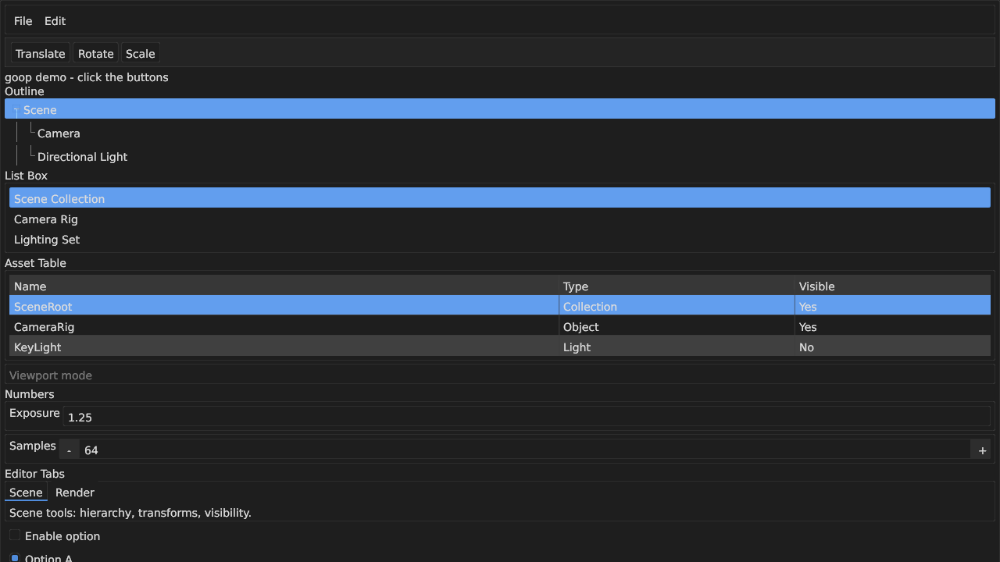

# goop

Retained-mode GUI library for Zig. `goop` owns widget state, layout, and draw
command generation; the embedder owns the native window, input delivery, text
measurement, and final rendering backend.

> [!WARNING]
> `goop` is still WIP. The widget surface is growing quickly, APIs are not
> stable yet, and the demo is a reference embedder rather than a polished end
> user application.



Current WIP demo on Wayland: outline rows, menus, tables, tabs, splitters,
numeric controls, and the editor-style chrome that the library is being built
around.

## What it is

`goop` is a retained tree of widgets plus three main runtime passes:

- layout through vendored `clay`
- input dispatch over platform-neutral events
- draw-list generation for an embedder-owned renderer

The core does not create windows, own the event loop, or issue GPU commands.
It tracks widget state, writes back layout rectangles, and emits simple draw
commands (`rect`, `text`, `clip`) that a caller can render however it wants.

Current pieces in-tree:

- retained widget tree with generational handles and subtree removal
- Zig API in [src/goop.zig](src/goop.zig)
- installable C API in [include/goop.h](include/goop.h)
- reference Wayland/EGL/OpenGL demo in [demo/main.zig](demo/main.zig)

## Current scope

Widgets currently implemented:

- container, text, button, checkbox, radio button, tree item
- dropdown, popup, tooltip, menu bar, menu, menu item
- list box, selectable
- table, table row, table cell
- drag value, spinbox, slider, text input
- tab bar, tab item
- splitter, scroll area
- toolbar, status bar

Still actively in progress:

- API cleanup and broader documentation
- fractional scaling and broader runtime portability
- UTF-8 text editing and richer text input behavior
- more embedder examples and validation beyond the current demo

For the current engineering snapshot and rough edges, see
[STATUS.md](STATUS.md).

## Build

Use `nix-shell` first. The shell provides the pinned Zig 0.16.0 toolchain plus
the demo's native dependencies, including `harfbuzz`.

```sh
nix-shell
zig build test          # unit tests
zig build               # library + demo
zig build demo          # build and run the Wayland demo
zig build install       # install libgoop, goop-demo, and goop.h to zig-out/
```

The core library only needs libc plus the vendored `clay` C source. The demo
additionally needs Wayland, EGL, OpenGL, `xkbcommon`, and a `.ttf` font. If
you are running the demo outside `nix-shell`, set `GOOP_DEMO_FONT_PATH` to a
font file if the built-in fallback paths do not exist on your system.

## Zig usage

```zig
const goop = @import("goop");

var ctx = try goop.Context.init(allocator, .{
    .width = 1280,
    .height = 720,
});
defer ctx.deinit();

const root = try ctx.tree.addRoot(.{ .container = .{ .direction = .column } });
const outline = try ctx.tree.addChild(root, .{ .tree_item = .{
    .label = "Scene",
    .group = 1,
    .selected = true,
} });
const button = try ctx.tree.addChild(root, .{ .button = .{ .label = "Run" } });

_ = outline;

// Queue embedder input for the current frame.
try ctx.pushEvent(.{ .mouse_move = .{ .x = 96, .y = 48 } });

// Layout, dispatch, then generate draw commands.
ctx.doLayout(null);
ctx.processEvents();

var draw_list = try ctx.generateDrawList();
defer ctx.freeDrawList(&draw_list);

if (ctx.wasClicked(button)) {
    // Handle the action in the embedder.
}
```

If you want accurate text sizing, pass a `TextMeasureCtx` into `doLayout()`.
If you pass `null`, `goop` falls back to a rough width estimate. For
single-frame click/change flags, call `clearClickedFlags()` at the start of
each frame before queuing new input.

## C API

`#include "goop.h"` for the C-facing surface. The C layer mirrors the retained
runtime rather than wrapping every Zig detail one-for-one.

```c
#include "goop.h"

goop_context_t *ctx = goop_context_create(&(goop_context_options_t){
    .width = 1280,
    .height = 720,
});

goop_node_handle_t root;
goop_widget_t root_widget = {
    .kind = GOOP_WIDGET_CONTAINER,
    .data.container = { .direction = GOOP_DIRECTION_COLUMN },
};
goop_context_add_root(ctx, &root_widget, &root);

goop_node_handle_t button;
goop_widget_t button_widget = {
    .kind = GOOP_WIDGET_BUTTON,
    .data.button = { .label = goop_string_from_cstr("Run") },
};
goop_context_add_child(ctx, root, &button_widget, &button);

goop_context_do_layout(ctx, NULL);

goop_draw_list_t draw_list;
goop_context_generate_draw_list(ctx, &draw_list);

goop_context_destroy(ctx);
```

The installed header covers:

- context lifecycle
- descriptor-based widget add/update/remove
- platform-neutral event push
- layout and draw-list generation
- widget state queries
- optional clipboard and text-measure callbacks

See [include/goop.h](include/goop.h) for the full interface.

## Using as a Zig dependency

Add `goop` to your `build.zig.zon`:

```zig
.dependencies = .{
    .goop = .{ .path = "../goop" },
},
```

Then build a module rooted at `src/root.zig` and pull in the vendored C
dependency:

```zig
const goop_dep = b.dependency("goop", .{});

const goop_mod = b.createModule(.{
    .root_source_file = goop_dep.path("src/root.zig"),
    .target = target,
    .optimize = optimize,
    .link_libc = true,
});
goop_mod.addIncludePath(goop_dep.path("include"));
goop_mod.addIncludePath(goop_dep.path("vendor/clay"));
goop_mod.addCSourceFile(.{
    .file = goop_dep.path("vendor/clay/clay.c"),
});

exe.root_module.addImport("goop", goop_mod);
```

The core library does not depend on `snail`. The current demo does, because it
uses `snail` for text measurement and rendering.

## Demo

The demo in [demo/main.zig](demo/main.zig) is the current reference embedder.
It exercises:

- Wayland input/event translation
- EGL/OpenGL rendering
- `snail`-backed text measurement
- real Wayland clipboard selection handling
- the current editor-oriented widget set

Run it with:

```sh
nix-shell --run 'zig build demo'
```

## Docs

- [STATUS.md](STATUS.md): current snapshot, priorities, known issues
- [docs/DESIGN.md](docs/DESIGN.md): architecture and constraints
