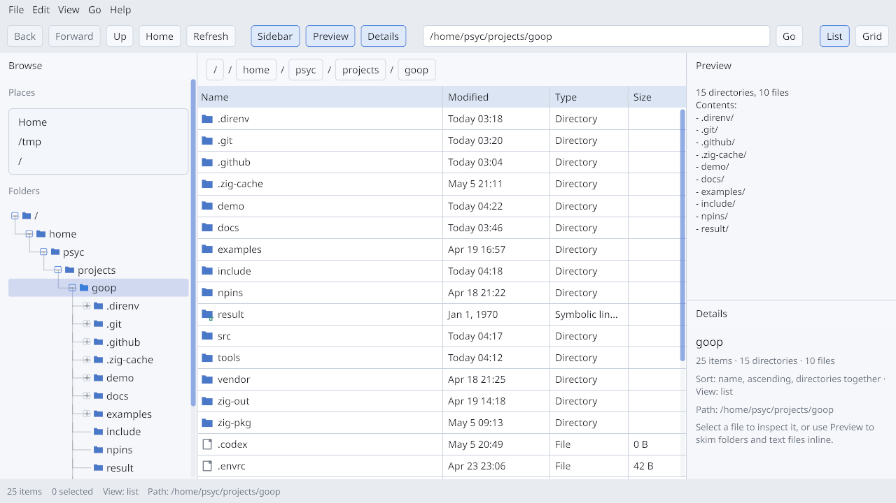

# goop

[](https://github.com/psyclyx/goop/actions/workflows/ci.yml)

Retained-mode GUI library for Zig. `goop` owns widget state, layout, and paint
command generation; the embedder owns the native window, input delivery, text
measurement, and final rendering.

> [!WARNING]
> `goop` is pre-1.0. Widgets land quickly and the API is still being shaped.
> The shipped demos are reference embedders, not finished applications.



The screenshot above is the file-manager example, rendered through the same
offscreen pipeline goop ships for CI. It exercises menus, toolbars,
breadcrumbs, sortable tables, splitters, sidebars, and the editor-style chrome
the library is being built around.

## What it is

`goop` is a retained widget tree plus three runtime passes:

- layout through vendored `clay`
- input dispatch over platform-neutral events
- paint-list generation for an embedder-owned renderer

The core does not create windows, own the event loop, or touch the GPU. It
tracks widget state, writes back layout rectangles, and emits semantic paint
commands (`surface`, `text`, `clip`, `icon`, `custom`) the caller renders
however it wants.

In-tree:

- retained widget tree with generational handles and subtree removal
- Zig API in [src/goop.zig](src/goop.zig)
- installable C API in [include/goop.h](include/goop.h)
- reference Wayland/EGL/OpenGL demos in [demo/](demo/)

## Widgets

container, spacer, text, button, checkbox, radio button, tree item, dropdown,
popup, tooltip, menu bar, menu, menu item, list box, selectable, grid
selector, grid item, table, table row, table cell, drag value, spinbox,
slider, text input, tab bar, tab item, splitter, scroll area, toolbar, status
bar.

For the engineering snapshot, priorities, and known rough edges, see
[STATUS.md](STATUS.md).

## Build

Use `nix-shell` first. The shell pins Zig 0.16.0 and the demo's native
dependencies (`harfbuzz`, `fontconfig`, Noto fonts).

```sh
nix-shell
zig build test               # unit tests
zig build                    # library + demo
zig build demo               # build and run the Wayland demo
zig build file-manager-demo  # build and run the file-browser Wayland demo
zig build c-example          # build and run the headless C API example
zig build perf-round         # run the headless retained-UI perf benchmark
zig build screenshot         # re-render docs/assets/goop-file-manager-demo.png
zig build install            # install libgoop (.a + .so), goop-demo, and goop.h to zig-out/
```

The core library only needs libc and the vendored `clay` C source. The demos
additionally need Wayland, EGL, OpenGL, `xkbcommon`, and a `.ttf` font. They
try `GOOP_DEMO_FONT_PATH` first, then `fontconfig`, then a few common system
paths.

## Zig usage

```zig
const goop = @import("goop");

var ctx = try goop.Context.init(allocator, .{ .width = 1280, .height = 720 });
defer ctx.deinit();

const root = try ctx.tree.addRoot(.{ .container = .{ .direction = .column } });
const button = try ctx.tree.addChild(root, .{ .button = .{ .label = "Run" } });

// One frame: clear last-frame flags, queue input, layout, dispatch, paint.
ctx.clearClickedFlags();
try ctx.pushEvent(.{ .mouse_move = .{ .x = 96, .y = 48 } });
ctx.doLayout(null);
ctx.processEvents();
const paint_list = try ctx.generatePaintList();
_ = paint_list; // Hand this to your renderer.

// Read interaction state through the per-node snapshot.
if (ctx.tree.node(button)) |view| {
    if (view.clicked) {
        // Handle the click.
    }
    switch (view.kind) {
        .button => |b| std.debug.print("label={s}\n", .{b.label}),
        else => {},
    }
}
```

`Context` is the single-tree convenience layer over `Runtime`: every method
is a thin forward to `Runtime` with the bundled `Tree`/`Theme`/`Clipboard`
supplied implicitly. Embedders that drive several trees from one runtime
(e.g. main window plus detached popup surfaces) wire up `Runtime` directly
with caller-owned `Tree`s.

Runtime contract:

- Build the tree through `ctx.tree.addRoot` / `ctx.tree.addChild` with a
  `WidgetDesc` payload. `WidgetDesc` exposes only the embedder-supplied
  fields; per-frame internal state (drag rects, marquee, editor buffers)
  lives behind each kind's `internal` substruct and is owned by
  dispatch/paint.
- Mutate widgets after construction through `ctx.setStyle(handle, ...)`,
  `ctx.updateWidget(handle, desc)`, `ctx.mutateKind(handle)`, or
  `ctx.setCustomPaint(handle, ...)`. These invalidate the layout/paint
  caches; reaching into `ctx.tree.get(handle)` directly does not.
- Add embedder-defined controls with `WidgetDesc.custom`. Custom widgets
  participate in layout, hit testing, focus/click state, `NodeView`, and
  paint as a `.custom` command at the widget's resolved bounds.
- Read state through `ctx.tree.node(handle)`, which returns a `NodeView`
  snapshot bundling the layout rect, cross-kind per-frame flags
  (`clicked`, `changed`, `toggled`, `drop_received`, `secondary_clicked`),
  and the kind-specific `WidgetView`. `clearClickedFlags()` resets the
  per-frame flags at the start of each frame.
- Snapshot per-frame pointer/focus/drop state with `ctx.frame()`.
- Pass a `goop.TextMeasureCtx` into `doLayout()` for accurate text
  sizing; pass `null` for a rough character-width estimate.
- `pushEvent` coalesces consecutive `mouse_move` and `mouse_scroll`
  events into the latest position / summed delta. Push a non-mouse event
  between samples if your gesture math depends on every move.
- Returned `PaintList` values borrow from the runtime; they stay valid
  until the next paint regeneration or context destruction.

## C API

`#include "goop.h"` for the C surface. The C layer mirrors the retained
runtime — same `Context` flow, same widget descriptors, same tagged read
view.

```c
#include "goop.h"

goop_context_t *ctx = goop_context_create(&(goop_context_options_t){
    .width = 1280,
    .height = 720,
});

goop_node_handle_t root;
goop_context_add_root(ctx, &(goop_widget_t){
    .kind = GOOP_WIDGET_CONTAINER,
    .data.container = { .direction = GOOP_DIRECTION_COLUMN },
}, &root);

goop_node_handle_t button;
goop_context_add_child(ctx, root, &(goop_widget_t){
    .kind = GOOP_WIDGET_BUTTON,
    .data.button = { .label = goop_string_from_cstr("Run") },
}, &button);

goop_context_do_layout(ctx, NULL);
goop_context_process_events(ctx);

goop_node_view_t view;
if (goop_context_node(ctx, button, &view) && view.kind.kind == GOOP_WIDGET_BUTTON) {
    /* view.clicked, view.kind.data.button.label */
}

goop_paint_list_t paint_list;
goop_context_generate_paint_list(ctx, &paint_list);

goop_context_destroy(ctx);
```

The installed header covers context lifecycle, descriptor-based widget
add/update/style/remove, platform-neutral event push (with a `mods` bitmask
on key/mouse events), layout and paint-list generation, the tagged read view,
per-frame snapshots, and optional clipboard and text-measure callbacks.

For a complete headless example, see [examples/c/basic.c](examples/c/basic.c)
and run it with `zig build c-example`.

## Using as a Zig dependency

Add `goop` to your `build.zig.zon`:

```zig
.dependencies = .{
    .goop = .{ .path = "../goop" },
},
```

Build a module rooted at `src/root.zig` and pull in the vendored C source:

```zig
const goop_dep = b.dependency("goop", .{});

const goop_mod = b.createModule(.{
    .root_source_file = goop_dep.path("src/root.zig"),
    .target = target,
    .optimize = optimize,
    .link_libc = true,
});
goop_mod.addIncludePath(goop_dep.path("include"));
goop_mod.addIncludePath(goop_dep.path("vendor/clay"));
goop_mod.addCSourceFile(.{ .file = goop_dep.path("vendor/clay/clay.c") });

exe.root_module.addImport("goop", goop_mod);
```

The core does not depend on `snail`. The bundled demos do, because they use
`snail` for text measurement and rendering.

## Demos

[demo/main.zig](demo/main.zig) is the reference Wayland embedder. It wires up
Wayland input/event translation, EGL/OpenGL rendering, `snail`-backed text
measurement, real Wayland clipboard selection handling, and exercises the full
widget set.

```sh
nix-shell --run 'zig build demo'
```

[demo/file_manager_main.zig](demo/file_manager_main.zig) is a Linux-style file
browser backed by the real filesystem: places sidebar, clickable breadcrumbs,
sortable details table, live details pane, all on the same Wayland/EGL/snail
stack.

```sh
nix-shell --run 'zig build file-manager-demo'
```

The same scene can be rendered without a display via
[tools/screenshot.zig](tools/screenshot.zig). It builds the file-manager
demo's State, runs one frame against an offscreen EGL pbuffer, reads the
framebuffer back, and pipes the pixels through ImageMagick to refresh the
README screenshot. CI re-runs this on every push.

```sh
nix-shell --run 'zig build screenshot'
```

## Docs

- [STATUS.md](STATUS.md) — current snapshot, priorities, known issues
- [docs/DESIGN.md](docs/DESIGN.md) — architecture and constraints
- [docs/C_API.md](docs/C_API.md) — C embedding flow, lifetimes, example notes
